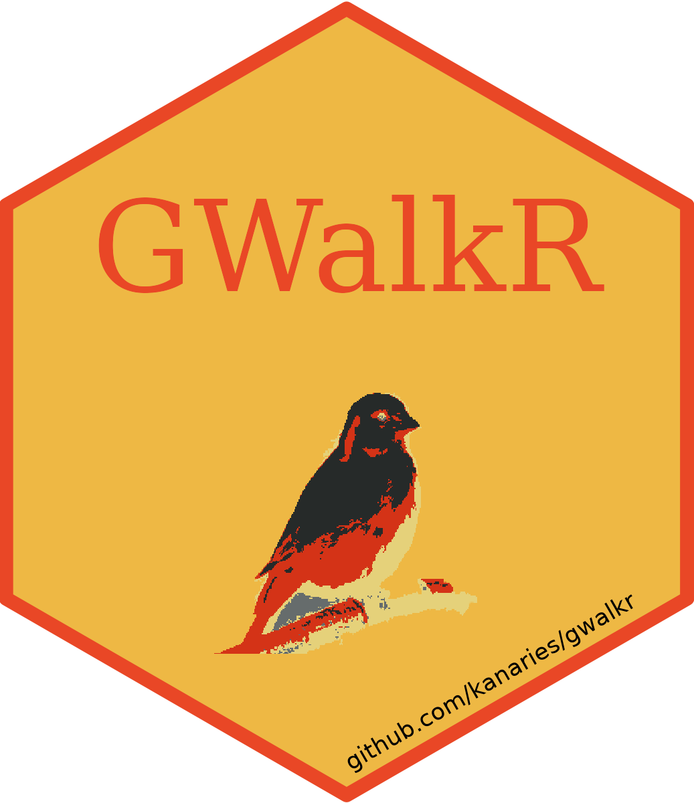

[English](README.md) | [中文](https://github.com/Kanaries/GWalkR/blob/main/docs/README.zh.md)



# GWalkR: Your One-Stop R Package for Exploratory Data Analysis with Visualization

[](https://CRAN.R-project.org/package=GWalkR)


[](https://twitter.com/kanaries_data)
[](https://discord.com/invite/WWHraZ8SeV)

Start Exploratory Data Analysis (EDA) in R with a Single Line of Code!
[GWalkR](https://github.com/Kanaries/GWalkR) is an interactive Exploratory Data Analysis (EDA) Tool in R.
It integrates the htmlwidgets with [Graphic Walker](https://github.com/Kanaries/graphic-walker).
It can simplify your R data analysis and data visualization workflow, by turning your data frame into a Tableau-style User Interface for visual exploration.


> If you prefer using Python, you can check out [PyGWalker](https://github.com/Kanaries/pygwalker)!

## Getting Started

### Setup GWalkR

#### Through CRAN (Recommended)

```R
install.packages("GWalkR")
```

#### Through Running R Script

If you have `devtools` installed in R, you can run the following R code to install.

```R
devtools::install_url("https://kanaries-app.s3.ap-northeast-1.amazonaws.com/oss/gwalkr/GWalkR_latest.tar.gz")
```

#### Through Package Archive File (.tar.gz)

Alternatively, download the package archive file `GWalkR_latest.tar.gz` from [this link](https://kanaries-app.s3.ap-northeast-1.amazonaws.com/oss/gwalkr/GWalkR_latest.tar.gz).
Open R Studio, click "Install" in the "Packages" window, and select "Package Archive File (.tgz; .tar.gz)" in the "Install from". Then, select the archive in your file system and click "Install".

### Start Your Data Exploration in a Single Line of Code

```R
library(GWalkR)
data(iris)
gwalkr(iris)
```


## Main Features
1. 🧑‍🎨 Turn a data frame into charts through simple drag-and-drop operations.
2. ✨ Empower your RMarkdown: Showcase your data insights with editable and explorable charts on a webpage ([example](https://bruceyyu.github.io/show/tidytuesday_etymology.nb.html))!
3. 🤖️ [coming soon] Work with AI copilot in R: Let AI generate explorable charts for you!


https://github.com/Kanaries/GWalkR/assets/33870780/4a3a9f9c-ff17-484b-9503-af82bd609b99
